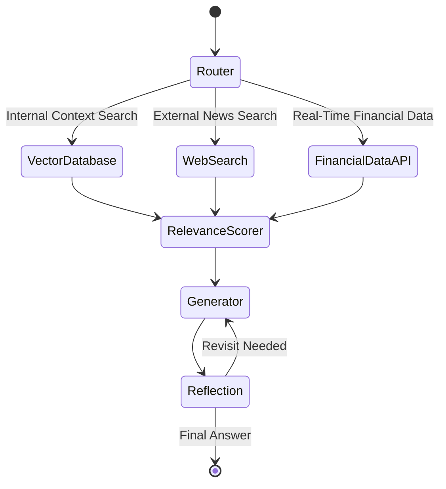

# TASK 1 Solution

### Solution Architecture for the "What’s New In" Platform

To design an agent capable of delivering dynamic and context-aware insights for the FinTech and Startup verticals, I propose leveraging **LangGraph** and **LangChain**. These frameworks offer robust orchestration for building multi-tool, multi-step agents that handle complex tasks reliably. Here's the detailed breakdown of the architecture:

---

### Core Workflow




---
### Agent as Graph


### Key Features of LangGraph and LangChain Integration

#### **1. Agentic Control with LangGraph**
LangGraph offers the ability to create modular, **stateful workflows** for agents, balancing precision and flexibility. Agents can operate in various modes: 
- **Single-Agent**: Handles queries end-to-end.
- **Multi-Agent**: Distributes tasks among multiple agents, each specialized for a subdomain (e.g., FinTech metrics or Startup trends).
- **Hierarchical**: Manages workflows where agents handle subtasks recursively.
- **Sequential and Parallel Execution**: Handles real-time and research-style tasks simultaneously.

The framework ensures high **reliability** through moderation layers and quality control loops that prevent agents from deviating from their purpose.

---

#### **2. LangChain for Tool Management**
LangChain serves as the backbone for integrating various tools, allowing seamless management of:
- **Retrieval-augmented generation (RAG)** pipelines.
- APIs for real-time data and search.
- Custom LLM prompts that adapt based on the retrieved context.

---

### Detailed Workflow Implementation

#### **Router with LangGraph**
The router dynamically decides which tools to invoke based on the query's intent and user-selected vertical (FinTech or Startups). LangGraph's JSON-based control ensures every decision is traceable and modifiable.

```python
router = LangGraphRouter(
    tools=["VectorDatabase", "WebSearch", "FinancialDataAPI"],
    routing_logic="Analyze query intent and prioritize tools based on relevance and speed."
)
```

---

#### **Data Retrieval and Processing**

##### Vector Database
For internal context and user-specific data, a **vector database** is used. LangChain makes it easy to integrate embeddings to retrieve domain-relevant content.

```python
vectorstore = LangChainVectorDB.from_documents(
    documents=vertical_documents,
    embedding_model="nomic-embed-v1.5"
)
retriever = vectorstore.as_retriever(k=3)
```

##### External Web Search
A web search tool fetches real-time news or trends from APIs like **NewsAPI**. LangChain's ability to parse, filter, and summarize search results ensures only the most relevant data is used.

```python
web_search_tool = LangChainTool.from_api(
    api_name="search_news",
    api_key="YOUR_API_KEY",
    parameters={"query": "latest FinTech news"}
)
```

##### Financial Data Retrieval
For live FinTech metrics, tools like **Alpha Vantage** or **Yahoo Finance API** are integrated. LangGraph's ability to schedule and track API calls ensures scalability for high-volume requests.

```python
financial_tool = LangChainFinancialAPI(
    endpoint="https://api.alpha-vantage.com",
    api_key="YOUR_API_KEY",
    params={"function": "TIME_SERIES_INTRADAY", "symbol": "MSFT"}
)
```

---

#### **Answer Generation and Refinement**

##### Scoring and Consolidation
LangGraph agents evaluate the retrieved data based on relevance, accuracy, and user query alignment.

```python
relevance_scorer = LangChainScorer(criteria=["semantic similarity", "context alignment", "freshness"])
```

##### Reflection for Quality Assurance
LangGraph's reflection capability ensures generated responses meet high standards. Agents can revisit their outputs and revise them when necessary.

```python
reflection_agent = LangGraphReflectionAgent(
    review_criteria=["response clarity", "relevance", "actionability"],
    reroute_if_failed=True
)
```

##### Streaming Outputs
LangGraph's **token-by-token streaming** allows the agent to share intermediate reasoning steps, enhancing user trust and engagement.

---

### Deployment with LangGraph Platform

LangGraph's platform supports both prototyping and production deployment:
- **Horizontal Scalability**: Handles large workloads with task queues and persistent state storage.
- **Dynamic APIs**: Simplifies agent customization for personalized experiences.
- **Integrated Developer Tools**: LangGraph Studio enables debugging, state tracking, and one-click deployment.

#### Sample Deployment Code
```python
app = LangGraphApplication(
    agent=multi_agent_workflow,
    deployment_mode="cloud",
    options={"logging": True, "scalability": "horizontal"}
)

app.deploy()
```

---

### Demo Flow: User Interaction

#### Step 1: Enter Query
The user selects a vertical (FinTech or Startups) and types their question into the UI. For example:
- Query: “What’s the latest in blockchain startups?”
- Vertical: “Startups”

#### Step 2: Agent Workflow
LangGraph routes the query through the appropriate tools:
- Vector Database: Checks for relevant historical context.
- Web Search: Retrieves real-time updates.
- Financial API: Provides metrics if applicable.

#### Step 3: Final Output
The generated response is streamed back to the user, including links to supporting documents.

---

### Future Enhancements

1. **Advanced Moderation**:
   - More robust quality control loops to prevent hallucination or irrelevant answers.
   
2. **Improved Statefulness**:
   - Adding **long-term memory** to agents for better user experience across sessions.

3. **Industry-Specific Expansion**:
   - Enabling plug-and-play modules for additional domains (e.g., healthcare, education).

4. **Developer Collaboration**:
   - Introduce collaborative debugging tools in LangGraph Studio for faster iteration.


# Task 2 Solution


